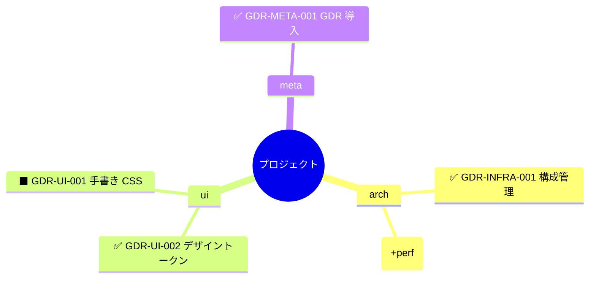
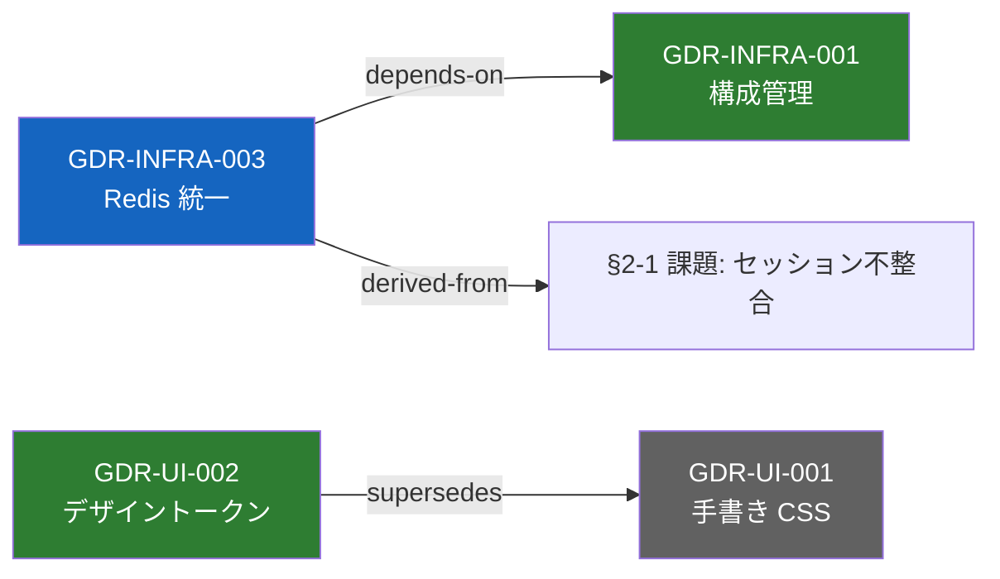

# 06. 可視化ガイドライン

GDR の蓄積をマインドマップ / グラフとして表現するためのガイドライン。書式側の前提（任意フィールド「日時」「関連」・主 scope・代替案記法）は [01 §3.1](/01_GDR/01_GENERAL_DECISION_RECORD.md#31-任意フィールド) を参照。経緯は [008 提案](/91_demo_buildup_documents.md/kaizen/08_GDR可視化対応提案.md)（GDR-META-024〜027）。

## 1. 原則

1. **正は型付き有向グラフ**（GDR-META-024） — ノードは GDR レコード（必要に応じて課題 `§N-M` / タスク）、エッジは閉集合の型を持つ。マインドマップ（木）は分類階層に限定した**派生ビュー**であり、横断関係の表現を木に求めない
2. **図はキャッシュ、正はソース文書**（GDR-META-026） — 図は GDR 文書から都度生成する。生成物の永続化は明示指定時のみとし、保存する場合も正は常に文書側
3. **出力は Mermaid テキスト** — diff 可能・VCS 親和。GitHub はネイティブ、Docsify はプラグインでレンダリングされる

## 2. エッジ語彙（閉集合）

| 型 | 意味 | 抽出元 |
|---|---|---|
| `supersedes` / `superseded-by` | 置換関係 | status 行（従来どおり） |
| `depends-on` | この決定は対象の決定を前提とする | 任意フィールド「関連」 |
| `refines` | 対象の決定を細分化・具体化した | 任意フィールド「関連」 |
| `relates-to` | 依存はしないが関連する | 任意フィールド「関連」 |
| `derived-from` | 由来（課題 `§N-M` や他 GDR） | 任意フィールド「関連」 |

語彙の追加・改廃は GDR-META で行う。

## 3. 構造ビュー（mindmap — 分類の全景）

scope（または PREFIX）を第一階層とする分類ツリー。**横断関係はこのビューでは描かない。**

- status は記号で表現する: **✅ Implemented / 🔷 Proposed / ⬛ Superseded**（Mermaid mindmap はノード単位の色指定が弱いため）
- 複数 scope のレコードは**主 scope**（先頭記載）の枝に置き、末尾に `(+pol)` のように併記する

## 4. 関係ビュー（flowchart — 型付き有向グラフ）

可視化の本命。ノードラベルは `GDR-ID + 短縮タイトル`、エッジラベルは §2 の型、status は classDef の色分け。

- supersede の向きは**新 → 旧**（`Supersedes` の語順どおり）
- 課題ノード（`§N-M`）は `derived-from` の参照先として必要なときだけ描く

## 5. 生成手順

生成手段は `/gdr-map`（[05_CLAUDE_CODE_SETUP.md](/01_GDR/guide/05_CLAUDE_CODE_SETUP.md) 参照。オプショナルコマンド — 既定 6 キーワード体系の外）。コマンド未導入の環境では、本ガイドを AI に参照させて同等の生成を依頼すればよい。

| 項目 | 仕様 |
|---|---|
| 入力 | `notes/91_gdr/` 配下の GDR 文書（+ 対象指定があれば `notes/20_kaizen/`） |
| 除外 | `notes/91_gdr/_reference/`（上流スナップショット）。`notes/_archive/` は明示指定時のみ |
| 既定ビュー | 関係ビュー（「構造」「マインドマップ」指定時のみ構造ビュー） |
| 出力 | セッション内提示が既定。`save` 指定時（`保存` も可）のみ `notes/91_gdr/map/{YYYY-MM-DD}_{対象}.md` に生成物ヘッダ（`<!-- generated by /gdr-map — 手編集禁止・正は GDR 文書 -->`）付きで保存 |
| 大規模時 | 全景が破綻する規模（目安: 数十ノード超）では scope / PREFIX / 指定 GDR の近傍（関連で繋がるノード）に絞る |
