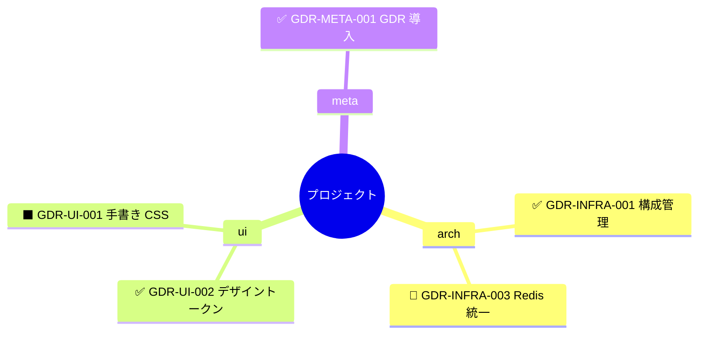
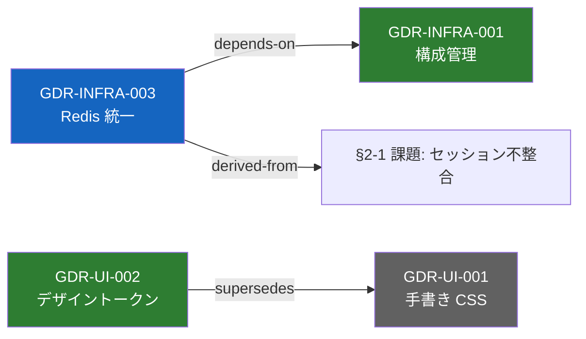

# 008. GDR 可視化対応提案（マインドマップ / グラフ表現）

## 目次

**GDR 一覧:**

| GDR ID | 決定の要約 | status |
|---|---|---|
| GDR-META-024 | 可視化のデータモデルは「型付き有向グラフ」を正とし、マインドマップは派生ビューとして定義する | Proposed |
| GDR-META-025 | 6 必須フィールドは不変のまま、任意フィールド「日時」「関連」を追加し、「代替案」は理由配下の既存記法を正式化する | Proposed |
| GDR-META-026 | 可視化は AI によるソース文書からの都度生成（Mermaid テキスト）を既定とし、生成物を既定では永続化しない | Proposed |
| GDR-META-027 | T2 の課題参照記法 `§{章}-{番号}` を正式化し、課題 → GDR → タスク → コミットの鎖を機械可読にする | Proposed |

---

## 1. GDR（General Decision Record）

**GDR-META-024: 可視化のデータモデルは「型付き有向グラフ」を正とし、マインドマップは派生ビューとして定義する**

- **status:** Proposed
- **scope:** meta, spec
- **決定:** GDR 可視化の正となるデータモデルを、ノード（GDR レコード / 課題 / タスク）と**型付きエッジ**からなる有向グラフとする。エッジ語彙は閉集合とし、既存の `supersedes` / `superseded-by` に加えて以下の 4 種を定義する:
  - `depends-on` — この決定は対象の決定を前提とする
  - `refines` — 対象の（より大きな）決定を細分化・具体化した決定である
  - `relates-to` — 依存はしないが関連する（弱い関連）
  - `derived-from` — この決定の由来（改善提案の課題 `§2-1` 等、または他 GDR）
  マインドマップ（木構造）は「scope または PREFIX → GDR」の**分類階層に限定した派生ビュー**と位置づけ、横断関係（supersede / depends 等）の表現は木に求めない。エッジ語彙の追加・改廃は GDR-META で行う
- **理由:** 判断の関係は木に収まらない — supersede 連鎖・決定間の依存・複数 scope を持つレコードは、いずれも木では表現できない横断枝である。グラフを正にすれば木はいつでも射影できるが、逆は不可能。またエッジに型がなければ「この枝は前提なのか、細分化なのか、置換なのか」が読み手に伝わらず、可視化の価値が半減する。語彙を閉集合にするのは、プロジェクト間の互換性と横断検索基盤（[007 提案](/91_demo_buildup_documents.md/kaizen/07_GDR横断検索基盤導入提案.md)の `links.kind`）への取り込みを保つため
  - **代替案 A:** 純粋な木構造（scope → PREFIX → GDR）のみ → 横断関係が落ちる。分類ビューとしては有用なため、派生ビューの 1 つとして採用（正にはしない）
  - **代替案 B:** 関連を自由記述メモとする → 機械抽出が不能になり、007 の `links` テーブルにも載らない。却下
  - **代替案 C:** 何もしない（AI が理由・影響の散文から都度関係を推定）→ 生成のたびに枝が変わり再現性がない。却下
- **影響:**
  - 007 gdr-index の `links.kind` 語彙が 2 種（supersedes 系）から 6 種に拡張される（仕様上の申し送り。§4.6）
  - 可視化ガイド（GDR-META-026）の 2 ビュー定義の根拠になる
- **再検討条件:**
  - 4 種で表現できない関係（`conflicts-with` 等）の需要が実運用で繰り返し発生 → 語彙追加の GDR-META を発行
  - エッジ型の使い分けに迷う事例が頻発 → 語彙の統合・簡素化を検討


**GDR-META-025: 6 必須フィールドは不変のまま、任意フィールド「日時」「関連」を追加し、「代替案」は理由配下の既存記法を正式化する**

- **status:** Proposed
- **scope:** meta, spec
- **決定:** [01 §3 書式](/01_GDR/01_GENERAL_DECISION_RECORD.md#3-書式)の 6 フィールドは**必須のまま不変**とし、以下の**任意フィールド**を 6 フィールドの後に追加可能とする:
  - `- **日時:** {YYYY-MM-DDTHH:MM:SS+09:00}` — 決定日時（**ISO 8601、タイムゾーンオフセット付き**）。時刻が不明な過去の判断は日付のみ（`YYYY-MM-DD`）の記載も許容し、解釈（00:00:00 扱い等）は取り込み側（gdr-index）で正規化する。status 遷移日時は追わない
  - `- **関連:** {型 GDR-ID または §参照 のカンマ区切り}` — 例: `depends-on GDR-INFRA-002, derived-from §2-1`（型は GDR-META-024 の閉集合）
  あわせて **scope の先頭記載を主 scope とみなす**（可視化等で代表 scope が必要な場面の規約。既存レコードは記載順のままで意味変更なし — 先頭が主でないレコードは起票者が並べ替えるだけでよい）。代替案は新フィールドを設けず、**既存慣行を正式記法として明文化**する: 理由フィールド配下のサブ箇条書き `- **代替案[ {ラベル}]:** {概要} → {評価}`。ラベル（A, B, ...）は**複数案あるときのみ必須**（1 件なら省略可）、末尾は却下した場合のみ「。却下」とし、部分採用・保留はその旨を記す。既存レコードの遡及改訂は行わない（任意フィールドのため不要）
- **理由:** 可視化に必要な情報（時間軸 / 型付きの枝 / 分岐した選択肢）のうち書式に欠けるのは日時と型付き関連のみで、代替案は既存レコードがすでに一貫した記法を持つ — 新フィールド化は全レコードの移行を強いるが、正式化なら移行コストゼロ（記法定義を既存実態に合わせて緩和してあるのはこのため）。必須化しないのは、書式の重さが起票のハードルになる損失の方が大きいため（GDR の価値はまず書かれること）。**日付でなく日時（時刻付き）とするのは、AI-Driven ビルドアップでは同日に複数の判断が積み上がるのが通常であり、日単位の粒度では DB 化（§4.6）の際に同日内の判断の前後関係が復元できないため**（レビュー反映中のユーザー指示で確定）。日時を git 履歴に頼らないのは、007 で確立した VCS 非依存原則（ソースは文書ファイルそのもの）との整合
  - **代替案 A:** 8〜9 必須フィールドへ拡張 → 全既存レコードが書式違反になり、起票コストも上がる。却下
  - **代替案 B:** YAML front matter でメタデータ付与 → ファイル単位の付与になり「1 ファイル複数レコード」（007 の実測）と不整合。却下
  - **代替案 C:** 散文のまま AI 抽出 → GDR-META-024 代替案 C と同じ理由で却下
- **影響:**
  - [01 §3](/01_GDR/01_GENERAL_DECISION_RECORD.md#3-書式) に「任意フィールド」の節を追記する
  - T2 テンプレートに任意フィールドの記入例を追記する（T0 / T1 は最小例を保つため 6 フィールドのまま）
  - gdr-index のパーサ追随が必要（GDR-META-020 の再検討条件「6 フィールド書式自体の改廃 GDR が発行された場合」が発動。§4.6）。lint は任意フィールドの欠落を警告**しない**
- **再検討条件:**
  - 任意フィールドの記入率が実運用で高止まり → 必須昇格を検討
  - 「関連」の記述が散文化して機械抽出が壊れる事例が頻発 → 記法の厳格化（lint 対象化）を検討


**GDR-META-026: 可視化は AI によるソース文書からの都度生成（Mermaid テキスト）を既定とし、生成物を既定では永続化しない**

- **status:** Proposed
- **scope:** meta, pol
- **決定:** 可視化の出力形式は **Mermaid テキスト**とし、2 つの標準ビューを定義する:
  - **構造ビュー**（`mindmap` 記法）— scope または PREFIX を第一階層とする分類の全景
  - **関係ビュー**（`flowchart` 記法）— 型付きエッジをラベル、status を classDef 色分けで表現する有向グラフ
  生成は GDR 文書（source of truth）から **AI が都度生成**し、既定はセッション内提示（永続化しない）。永続化する場合は `notes/91_gdr/map/` 配下に「生成物・手編集禁止」ヘッダ付きで保存し、正は常に GDR 文書側とする。生成手段はスラッシュコマンド **`/gdr-map`**（キーワード `マップ：` はプロジェクト固有の任意拡張）とし、**既定 6 キーワードには加えない**。Docsify サイトには mermaid プラグインを導入し、ガイド内の記法例をレンダリング可能にする
- **理由:** Mermaid はテキストであるため diff 可能・VCS 親和で、GitHub はネイティブ、Docsify はプラグインでレンダリングでき、外部ツールの契約が増えない。都度生成を既定にするのは、永続化された図がソース文書の更新で必ず陳腐化するため — これは [GDR-META-023](/91_demo_buildup_documents.md/kaizen/07_GDR横断検索基盤導入提案.md) の「正しさの根拠を rebuild に置く」と同型の判断であり、**図はキャッシュ、正はソース文書**。既定 6 キーワードに加えないのは、可視化は「読む」行為でありビルドアップサイクルの節目（書く行為）ではないため — サイクル必須の操作だけを既定に置く現行方針を維持する
  - **代替案 A:** PlantUML / Graphviz DOT → レンダリング環境の追加契約が必要で、GitHub ネイティブ表示も不可。却下
  - **代替案 B:** 画像（PNG / SVG）をコミット → diff レビュー不能・陳腐化の検知も不能。却下
  - **代替案 C:** gdr-index に graph エクスポートを実装してから着手 → 007 はフェーズ 0 で停止中であり、可視化はパーサなしでも AI 生成で今日から成立する。ツール実装を前提にしない（gdr-index 側の `graph` サブコマンドは将来の決定性向上の統合候補として申し送る。§4.6）
  - **代替案 D:** D3.js 等のインタラクティブ HTML → 個人運用・現状規模（15〜20 レコード）に過剰。再検討条件行き
- **影響:**
  - `guide/06_VISUALIZATION_GUIDE.md` を新設する（2 ビューの正式定義・status の視覚語彙・生成手順）
  - `docs/index.html` / `docs/ja/index.html` に docsify-mermaid プラグインを追加する
  - `~/.claude/commands/gdr-map.md` を新設し、[05_CLAUDE_CODE_SETUP](/01_GDR/guide/05_CLAUDE_CODE_SETUP.md) に追記する（オプショナルコマンド — 既定 6 キーワード体系は不変）
- **再検討条件:**
  - レコード数が全景描画に耐えない規模（数百超）→ フィルタ仕様（§4.5）の強化、またはインタラクティブ表示（代替案 D）の再検討
  - gdr-index フェーズ 3 以降が実装された → 生成の決定性向上のため `gdr-index graph` エクスポートへの移行を検討


**GDR-META-027: T2 の課題参照記法 `§{章}-{番号}` を正式化し、課題 → GDR → タスク → コミットの鎖を機械可読にする**

- **status:** Proposed
- **scope:** meta, spec
- **決定:** T2 文書内の課題・検討課題への参照記法を **`§{セクション番号}-{項目番号}`**（例: `§2-1` = 現状の課題 1、`§5-3` = 検討課題 3）として正式化し、T2 テンプレートに明記する。GDR の任意フィールド「関連」の `derived-from`、および検討課題の「→ フェーズ N のタスクとして追加済み」行から、この記法で参照する。新規 ID 体系（`K-01` 等）は導入しない
- **理由:** 「課題 → GDR → タスク → コミット」のトレーサビリティ鎖のうち、タスク → GDR（実行計画の根拠 GDR 列）とタスク → コミット（進捗サマリー）はすでに機械可読で、切れているのは起点の「課題 → GDR」だけ。`§N-M` 記法は 007 提案がすでに事実上使っており（「§5-1」「後述 §2-5」）、正式化は移行コストゼロ。新 ID 体系は採番管理という新たな運用を増やすため見送る
  - **代替案:** `K-{NN}` 等の独立 ID の新設 → 文書内でセクション番号と二重管理になり、採番ルールも増える。却下
- **影響:**
  - T2 テンプレートの §2 / §5 に記法の注記を追加する
  - 可視化の関係ビューで課題ノードが描けるようになり、「どの課題がどの決定を生んだか」が枝として見える
- **再検討条件:**
  - セクション構成の変更で `§` 参照の連動更新漏れが頻発 → アンカー方式（見出し ID 参照）への変更を検討

---

## 2. 現状

1. **エッジ情報が散文に埋没している** — GDR 間の明示リンクは `Supersedes / Superseded by` の 1 種類のみ。決定間の依存・細分化・由来は「理由」「影響」の散文中にしか存在せず、グラフの枝として機械的に引けない
2. **代替案の記法に正式仕様がない** — 実運用レコード（007 等）は「理由配下の `- **代替案 A:** ... 却下`」という一貫した記法をすでに持つが、[01 §3](/01_GDR/01_GENERAL_DECISION_RECORD.md#3-書式) はこれを規定していない。分岐（採用案 / 棄却案）は可視化の主要な枝であり、記法が仕様外のままだと抽出の安定性が保証されない
3. **決定日時がどこにもない** — 書式に日時フィールドがなく、時間軸レイヤー（「この四半期の決定」等）の表現が不可能。同日に複数の判断が積み上がっても前後関係を記録する手段がない。007 で確立した VCS 非依存原則のもとでは git log にも頼れない
4. **T2 の課題に参照可能な ID がない** — 実行計画のタスクは「根拠 GDR」「依存」「コミット」を持ちすでにグラフ化可能だが、§2 現状・§5 検討課題は番号付きリストのみで、トレーサビリティ鎖の起点（課題 → GDR）だけが切れている
5. **可視化の出力仕様・生成手段が未定義** — 現状 AI に「マインドマップにして」と頼むと、形式（Mermaid / PlantUML / インデントテキスト）も粒度も毎回揺れる。再現可能な標準ビューの定義がない
6. **すでに揃っているもの（本提案で触らない）** — scope / PREFIX の 2 分類軸（構造ビューの第一階層に使える）、status 3 値（色分けに使える）、Supersedes 相互リンク（唯一の既存エッジ）、T2 実行計画のタスク ↔ GDR ↔ コミット対応。不足は少数であり、書式の破壊的変更は不要

---

## 3. 改善案

4 つの GDR で「データモデル」「書式」「出力と生成」「トレーサビリティ」を定義する。書式変更は**任意フィールドの追加と既存慣行の正式化のみ**で、既存レコードへの遡及影響はない。

1. **データモデル: 型付き有向グラフが正、木は派生ビュー**（GDR-META-024）— エッジ語彙 6 種の閉集合
2. **書式: 任意フィールド「日時」「関連」+ 代替案記法の正式化**（GDR-META-025)— 6 必須フィールド不変・後方互換
3. **出力と生成: Mermaid 2 ビュー・AI 都度生成・永続化しない**（GDR-META-026）— 図はキャッシュ、正はソース文書
4. **トレーサビリティ: `§N-M` 参照記法の正式化**（GDR-META-027）— 課題 → GDR → タスク → コミットの鎖が閉じる

---

## 4. 詳細セクション

### 4.1. 全体像

```
[GDR 文書（source of truth）]
  notes/91_gdr/gdr/*.md          6 必須フィールド + 任意（日付 / 関連）
  notes/20_kaizen/*.md           T2: 課題（§N-M）/ GDR / タスク / コミット
        │
        │  /gdr-map（AI が読み取り → Mermaid 生成。既定は永続化しない）
        ▼
  ┌─ 構造ビュー（mindmap）──── scope / PREFIX → GDR の分類全景
  └─ 関係ビュー（flowchart）─── 型付きエッジ + status 色分けの有向グラフ
        │
        └─ 提示先: セッション内（既定）/ notes/91_gdr/map/（明示指定時のみ）
```

### 4.2. 書式拡張後のレコード例

```markdown
**GDR-INFRA-003: セッションストアを Redis に統一する**

- **status:** Implemented
- **scope:** arch, perf
- **決定:** {何をするか}
- **理由:** {なぜか}
  - **代替案 A:** {概要} → {却下理由}。却下
- **影響:** {具体的な影響}
- **再検討条件:** {状況変化}
- **日時:** 2026-07-15T14:30:00+09:00
- **関連:** depends-on GDR-INFRA-001, derived-from §2-1
```

- 任意フィールドは 6 必須フィールドの**後**に置く（パーサの寛容性を保つ）
- 「関連」の各項目は `{型} {対象}` の形式。対象は GDR ID（`GDR-{PREFIX}-{番号}`）または同一文書内の `§N-M` 参照

### 4.3. 構造ビュー（mindmap）

scope を第一階層にした分類の全景。status は記号（✅ Implemented / 🔷 Proposed / ⬛ Superseded）で表現する（Mermaid mindmap はノード単位の色指定が弱いため記号を使う）。



- 横断関係（supersede / depends）は**このビューでは描かない**（GDR-META-024: 木は分類専用）
- 複数 scope のレコードは主 scope（先頭記載 — GDR-META-025 で正式化）の枝に置き、末尾に `(+pol)` のように併記する

### 4.4. 関係ビュー（flowchart）

型付きエッジと status 色分けの有向グラフ。可視化の本命。



- ノード = GDR レコード（+必要に応じて課題 `§N-M`）。ラベルは `GDR-ID + 短縮タイトル`
- エッジラベル = GDR-META-024 の型。supersede は既存の status 行から、その他は任意フィールド「関連」から抽出する

### 4.5. `/gdr-map` コマンド仕様（要点）

| 項目 | 仕様 |
|---|---|
| 引数 | `[<scope / PREFIX / GDR-ID / ファイルパス>]`（省略時は全景） |
| モード A（引数あり） | 指定対象に絞ったビューを生成。GDR-ID 指定時はその近傍（関連で繋がるノード）のみ |
| モード B（引数なし） | `notes/91_gdr/`（+ 対象指定があれば `notes/20_kaizen/`）を走査して全景を生成。レコード数が多く全景が破綻しそうな場合は AskUserQuestion で scope の絞り込みを提案 |
| ビュー選択 | 既定は**関係ビュー**。「構造」「マインドマップ」の語が引数にあれば構造ビュー |
| 出力先 | 既定はセッション内提示のみ。「保存」の語が引数にあれば `notes/91_gdr/map/{YYYY-MM-DD}_{対象}.md` に生成物ヘッダ付きで保存 |
| 除外 | `notes/91_gdr/_reference/`（上流スナップショット）と `notes/_archive/`（明示指定時のみ）。007 の除外ルールと同一 |

### 4.6. gdr-index（007 提案）との整合 — 申し送り

本提案は 007 の実装に**依存しない**（AI 都度生成で成立する）が、007 実装時に以下の追随が必要になる:

1. **`links.kind` の語彙拡張** — supersedes 系 2 種 → GDR-META-024 の 6 種。抽出元は status 行（supersede 系）と任意フィールド「関連」。ただし `links` は両端がレコードである前提のため、正規化するのは**対象が GDR-ID の関連だけ**。`§N-M` 参照（文書内セクションが対象）は `records` 側のテキスト列（例: `derived_from_ref`）として保持するか、初期実装ではスキップする
2. **`records` への任意フィールド列の追加** — `decided_at`（**日付時刻**。タイムゾーンオフセット保持 or UTC 正規化は gdr-index 実装時に確定。日付のみの記載は取り込み時に正規化）
3. **パーサの追随** — GDR-META-020 の再検討条件「6 フィールド書式自体の改廃 GDR が発行された場合」が本提案（GDR-META-025）で発動する。任意フィールドのため寛容パースの範囲で吸収可能
4. **将来の統合候補** — `gdr-index graph --format mermaid` エクスポート（GDR-META-026 の再検討条件）。実装されれば `/gdr-map` の抽出工程を決定的にできる

007 本文は編集しない（起票済み文書の遡及編集を避ける）。007 の実装フェーズ着手時に本節を参照すること。

---

## 5. 検討課題

1. **既定 6 キーワードへの `マップ：` 追加是非**
   - 解決策: 加えない。可視化は「読む」操作でサイクルの節目ではなく、既定キーワードはサイクル必須操作に限定する現行方針を維持。`/gdr-map` はオプショナルコマンド、`マップ：` はプロジェクト固有の任意拡張とする
   - → GDR-META-026 の仕様として確定
2. **Mermaid mindmap 記法の表現力の制約（エッジ型・色分けが弱い）**
   - 解決策: 構造ビューは分類専用と割り切り（status は記号で代替）、関係表現はすべて flowchart に寄せる
   - → GDR-META-024 / 026 の 2 ビュー分担として確定
3. **大規模時（レコード数百超）の全景描画の破綻**
   - 解決策: `/gdr-map` のフィルタ（scope / PREFIX / 近傍）で当面対応。破綻が実際に起きたら GDR-META-026 の再検討条件（インタラクティブ表示）を発動
   - → 再検討条件として登録済み
4. **T0 / T1 テンプレートへの任意フィールド反映是非**
   - 解決策: 反映しない。T0（最初の GDR サンプル）と T1 は「最小の型」を示す役割のため 6 フィールドのままとし、任意フィールドは 01 仕様と T2 にのみ記載する
   - → GDR-META-025 の影響欄に明記済み
5. **docsify-mermaid プラグインの CDN 依存追加**
   - 解決策: 既存の docsify 本体・search プラグインと同じ jsdelivr CDN 経路のため、新たな依存種別は増えない。導入する
   - → フェーズ 2 のタスクとして実行計画に追加済み

---

## 6. 実行計画

### 6.1. タスク一覧

| # | タスク | 根拠 GDR | 依存 | ステータス |
|---|---|---|---|---|
| 0.1 | 本提案のレビュー → 反映 → 合意 | 024〜027 | — | 進行中 |
| 1.1 | 01 §3 に「任意フィールド」節を追記（日時 / 関連 / 代替案記法 / 主 scope） | GDR-META-025 | 0.1 | 未着手 |
| 1.2 | T2 テンプレート更新（任意フィールド例 + `§N-M` 記法の注記） | GDR-META-025, 027 | 0.1 | 未着手 |
| 2.1 | `guide/06_VISUALIZATION_GUIDE.md` 新設（2 ビュー定義・視覚語彙・生成手順） | GDR-META-024, 026 | 1.1 | 未着手 |
| 2.2 | docsify-mermaid プラグイン導入（`docs/index.html` / `docs/ja/index.html`） | GDR-META-026 | — | 未着手 |
| 2.3 | `_sidebar.md` / README 同期 | — | 2.1 | 未着手 |
| 3.1 | `~/.claude/commands/gdr-map.md` 新設（§4.5 仕様） | GDR-META-026 | 2.1 | 未着手 |
| 3.2 | `05_CLAUDE_CODE_SETUP.md` に `/gdr-map` 追記（オプショナル、2 モード対応表への登録込み） | GDR-META-026 | 3.1 | 未着手 |
| 3.3 | `~/.claude/CLAUDE.md` のハイブリッド表に `/gdr-map` 行を追加（任意拡張の注記付き） | GDR-META-026 | 3.1 | 未着手 |

### 6.2. フェーズ詳細

#### フェーズ 0: 合意・準備

**目的:** 文書 → レビュー → 合意の順序を守る。

- [ ] 0.1 本提案のレビューと合意（`レビュー：` → `レビュー反映：` → 合意）

#### フェーズ 1: 書式拡張（仕様側）

**目的:** 可視化に必要な情報が書式レベルで記録可能になる。

- [ ] 1.1 01 §3 任意フィールド節の追記
- [ ] 1.2 T2 テンプレート更新

#### フェーズ 2: 可視化ガイド（表現側）

**目的:** 2 つの標準ビューが再現可能な形で定義され、サイトでレンダリングされる。

- [ ] 2.1 可視化ガイド新設
- [ ] 2.2 docsify-mermaid 導入
- [ ] 2.3 sidebar / README 同期

#### フェーズ 3: コマンド化（生成側）

**目的:** `/gdr-map` で誰でも同じビューを再生成できる。

- [ ] 3.1 gdr-map コマンド定義の配備
- [ ] 3.2 セットアップガイド追記
- [ ] 3.3 user CLAUDE.md ハイブリッド表更新

### 6.3. 進捗サマリー

| フェーズ | タスク数 | 完了 | 残 | コミット |
|---|---|---|---|---|
| 0 | 1 | 0 | 1 | — |
| 1 | 2 | 0 | 2 | — |
| 2 | 3 | 0 | 3 | — |
| 3 | 3 | 0 | 3 | — |

---

## 7. ふりかえり

> 起票時点（2026-07-15）の記録。実装フェーズの完了ごとに追記する。

### 7.1. 観察された傾向

1. **過剰設計の圧縮** — 設計対話の初期段階で、必須フィールド化（全レコード移行）・独立 ID 体系（K-01）・YAML front matter・D3 / GUI ツール・グラフ DB をいずれも却下し、「任意フィールド 2 つ + 既存慣行の正式化 2 つ」まで圧縮した。書式の破壊的変更ゼロが本提案の背骨
2. **実装からの発見** — 起票前のギャップ分析（本セッション冒頭）が起点。「ノードは揃っているがエッジが散文に埋没している」という診断が、そのまま GDR-META-024 / 025 の構成になった
3. **フレームワークの自己進化** — 007 GDR-META-023 の「正しさの根拠を rebuild に置く」哲学が、本提案の「図はキャッシュ、正はソース文書」（GDR-META-026）に転写された。判断の型がプロジェクトを跨いで再利用される連鎖が起きている
4. **レビュー工程での検出** — セルフレビューが (1) 正式化した代替案記法に自文書の GDR-META-027 自身が違反する自己矛盾（ラベル必須の定義が既存実態と乖離）、(2) `§N-M` 参照を 007 の `links` テーブルに正規化できない申し送りの不備、(3) 「主 scope = 先頭」という暗黙の仕様追加、の 3 点を着手前に検出した。正式化・申し送りの精度の問題はレビュー工程が拾えることの実例
5. **対話による設計の深化（ユーザー指示）** — レビュー反映中のユーザー指示「DB 化する際に timestamp はしっかり管理したい。日付時刻を持つようにして」により、任意フィールドを日付（日単位）から**日時（ISO 8601 オフセット付き）**へ格上げ。同日に複数の判断が積み上がる AI-Driven ビルドアップの実態に対し、同日内の前後関係が DB 上で復元可能になった。書式の初版確定前に粒度が正された — 修正コストが最小の時点で指摘が入る、レビュー → 合意順序の配当

### 7.2. 次回への申し送り

- 最初のブロッカーは フェーズ 0（レビュー → 合意）
- gdr-index（007）実装着手時は **§4.6 の申し送り 4 点**（links.kind 拡張 / decided_on 列 / パーサ追随 / graph エクスポート候補）を必ず参照する — GDR-META-020 の再検討条件が発動している
- 任意フィールド「日時」「関連」の記入率を次の横断レビューで観察し、高止まりなら必須昇格（GDR-META-025 の再検討条件）を判定する
- 実レコードで関係ビューを一度生成し、エッジ型 4 種の過不足（`conflicts-with` の需要等）を確認する
